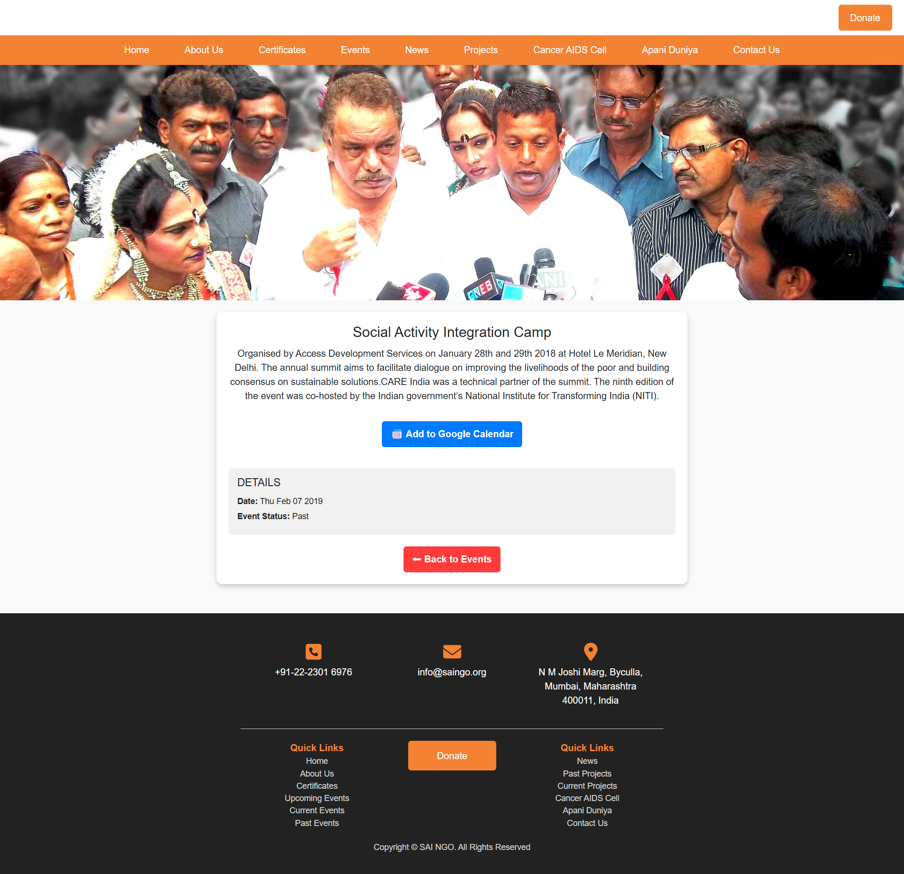

# Sai NGO Website 🌿

A full-stack responsive website developed for **Sai NGO**, a non-profit organization dedicated to supporting **cancer-affected children**, **sex workers** and promoting **humanitarian efforts**.

## 🌟 Overview

This website provides a clean and intuitive interface to showcase Sai NGO’s mission, projects, events, news coverage and a secure donation system. It is designed to be responsive and user-friendly across all devices.

---

## 📌 Features

- **Home Page**  
  Hero section, introductory text, "Who Are We" and featured projects.

- **About Us**  
  Includes mission statement, team profiles, their achievements and board members.

- **Certificates Page**  
  Lists all official certificates and documentation in a clean layout.

- **Events Page**  
  Displays upcoming, current and past events with interactive cards. Clicking opens detailed view.

- **News Page**  
  Showcases Sai NGO’s coverage in actual newspapers.

- **Projects Page**  
  Divided into past and ongoing projects with brief and expanded views.

- **Cancer/AIDS Cell**  
  Cards of all child patients supported. Each card links to a detailed view of the patient's story.

- **Apani Duniya Page**  
  Showcases the physical land project undertaken by the NGO.

- **Contact Us Page**  
  Functional contact form to connect with the NGO team.

- **Donate Page**  
  Detailed section with T&C, return policy and registration policy. Includes a comprehensive donor form.

---

## 🛠️ Tech Stack

- **Frontend:** HTML, CSS, JavaScript  
- **Backend:** PHP  
- **Database:** MySQL  
- **Responsive Design:** Mobile-first approach with clean, adaptive UI

---

## 📸 Screenshots

| Page | Screenshot |
|------|------------|
| Home Page |  |
| About Us Page |  |
| Certificates Page |  |
| Events Page |  |
| Event Description Page |  |
| News Page |  |
| Cancer/AIDS Cell |  |
| Cancer/AIDS Cell Description |  |
| Apani Duniya |  |
| Contact Us |  |
| Donate Page |  |

---

## 🧑‍💻 Developer Info

**Developed by:** AlgoDevOpss by Yash Balotiya
**Email:** balotiyash@gmail.com
**GitHub:** [balotiyash](https://github.com/balotiyash/)  
**LinkedIn:** [balotiyash](https://www.linkedin.com/in/balotiyash/)  

---

## 📄 License

This project is developed specifically for **Sai NGO** and may not be reused or redistributed without permission.